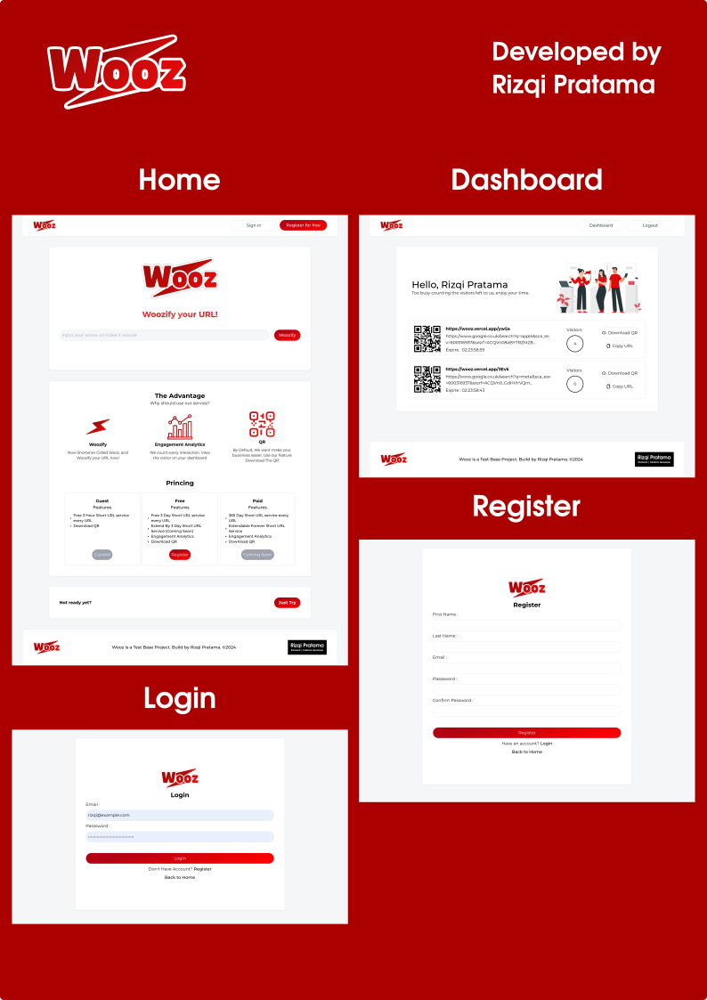

# Wooz Shortener App - frontend

## Table Of Content

- [Wooz Shortener App - frontend](#wooz-shortener-app---frontend)
  - [Table Of Content](#table-of-content)
  - [Description](#description)
    - [Frontend Feature](#frontend-feature)
  - [Project Challange](#project-challange)
  - [Screenshoot](#screenshoot)
  - [How to run](#how-to-run)
    - [On Local Development](#on-local-development)
    - [On Production](#on-production)
  - [Environment Variable](#environment-variable)
  - [Backend Project](#backend-project)

## Description

Woozify is a service that allows users to shorten URLs and generate QR codes. The features include shortening URLs, providing engagement analytics, and a QR Maker. The pricing types are guest, free, and paid.

### Frontend Feature

- Create Short URL
- Create QR
- Redirect to original
- User Register
- User Login
- User Dashboard
- Visitor Counter for registered user

Developer : Rizqi Pratama  
Deploy on : Vercel  
Deployment URL : <http://wooz.vercel.app>  
Tech Stack : NextJS, Typescript, React, Tailwind, SASS

## Project Challange

- User interface:
  - Allow users to enter a long URL and receive a shortened version ✅
- Display shortened URL:
  - Show the shortened URL and the original URL side by side ✅
- Copy shortened URL:
  - Allow users to easily copy the shortened URL to their clipboard ✅
- Optional features:
  - Track clicks on shortened URLs ✅
  - Show usage statistics for shortened URLs ✅

## Screenshoot

## How to run

### On Local Development  

1. Clone this repo
2. Setup the Environment Variable
3. Install Dependencies ``yarn install``
4. Start the app ``yarn dev``

### On Production

There are various ways to run the application in production. Every detailed step is important, please refer to documentation provided by your cloud provider.

## Environment Variable

For the environment variable there is file reference at root this project named ``.env.example``, use this as the reference to configuring environment variable for this app. **Important: All environment variables must be filled.**

## Backend Project

<https://github.com/rizqikazukun/703534e6-4c5a-4158-9f37-5f27c6036a7d>
